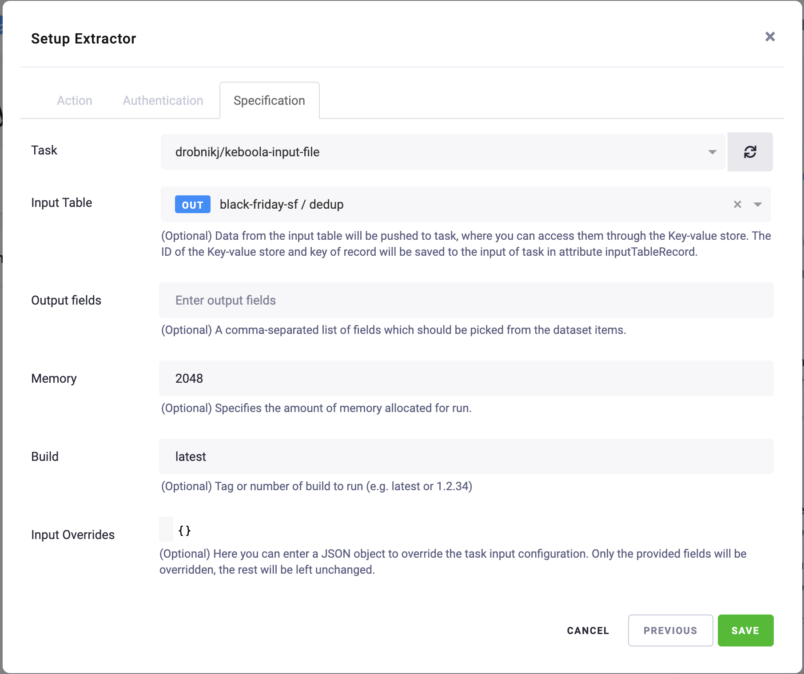

# Keboola Input mapping

The actor parses input table from Apify <> Keboola extractor and maps the data into another task or actor input.
If you didn't use Apify <> Keboola integration yet, this tool is not what you are probably looking for. But you
can follow [this article](https://help.apify.com/en/articles/2003234-keboola-integration) to learn about integration.

## Introduction

It is not possible to pass input table from the Keboola extractor into any public actor. Because Keboola extractor passed
input table using key-value store and the storeId and key of the input table put into actor/task input. And because
storeId and key is not part of any public actor and will be omitted. This tool helps you run actor/task from the Keboola
extractor and map the input table into actor/task input.

## Use Case - Web Scraper

Imagine we have in Keboola tabled data in CSV in this format:
```csv
Title,URL,ID
Test1,http://example.com#1,product_1
Test2,http://example.com#2,product_2
Test3,http://example.com#3,product_3
Test4,http://example.com#4,product_4
Test5,http://example.com#5,product_5
```
We need to run the task of apify/web-scraper, where URL column will be use on input as "Start URLs".
In this case we will create new task of this actor. We will fill
"Target Task ID" with name of created web-scraper task and
"Input mapping function" with simple Javascript function which maps CSV into input.
```javascript
function inputMappingFunction({ currentInput, parsedInputTableCsv }) {
    const startUrls = parsedInputTableCsv.map((line) => {
        return { url: line['URL'] };
    });
    return {
        startUrls,
    };
}
```
We will save the task, go to Keboola, use the created task in Apify extractor, and select the table we
want to pass.

After save and run this configuration, the task should run our target task and use input created in the mapping function.

## Miscellaneous

If you are struggling with the Apify <> Keboola setup, please contact [Apify support](mailto:support@apify.com) or me.
