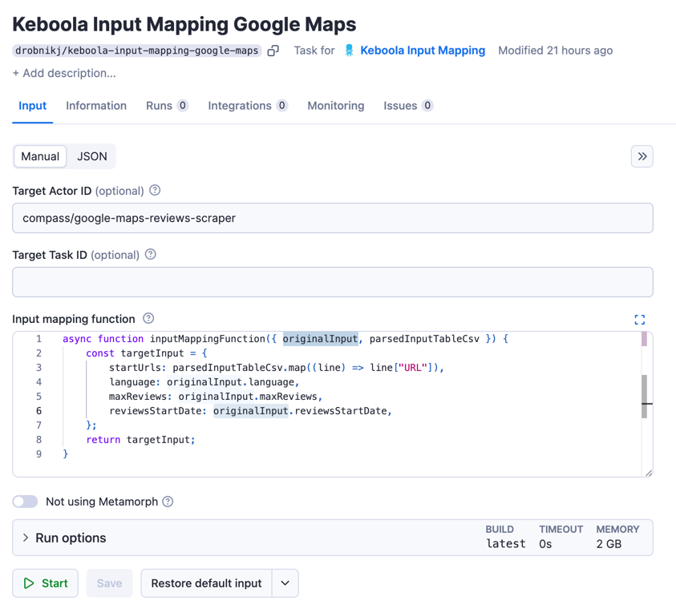

# Keboola Input Mapping

This Actor parses the input table from the Apify <> Keboola extractor and maps the data into another task or Actor input. If you haven't used the Apify <> Keboola integration yet, this tool is probably not what you're looking for, and you should read [this article](https://help.apify.com/en/articles/2003234-keboola-integration) to learn more about the integration.

## Introduction

It is not possible to pass the input table from the Keboola extractor into any public Actor because the Keboola extractor passes the input table using a key-value store. The `storeId` and key of the input table are put into the Actor/task input. Since `storeId` and key are not part of any public Actor, they will be omitted. This tool helps you run an Actor/task from the Keboola extractor and map the input table into Actor/task input.

## Setup

The recommended way to use it is to create a task out of this Actor and predefine the target task or Actor you need to run, along with the input mapping function.



Afterward, you can easily run this task from Keboola using the Apify component and the "Run task" action on the Keboola platform.


With this setup, you will run the component on Keboola with Input Table data, and the data will be passed to the target Actor or task based on the mapping function. When the target task or Actor finishes, you will receive data in the Keboola platform.

## Input Configuration

The following configuration settings can be entered manually in the Apify Console or programmatically via a JSON object using the Apify API. Below is a summary of the input fields:

### Target Actor or Task
Specifies the Actor or task to run.

### Input Mapping
The JavaScript function that maps the data from Keboola into the input for the target task or Actor. The function has two parameters:

#### parsedInputTableCsv
The data parsed from the Keboola Input Table in array format. The array will have items as objects where each object will have properties based on columns.
```csv
Title,URL
Test1,http://example.com#1
Test2,http://example.com#2
```
will transform into:
```javascript
[
    {
        "Title": "Test1",
        "URL": "http://example.com#1"
    },
    {
        "Title": "Test2",
        "URL": "http://example.com#2"
    }
]
```

#### originalInput
This parameter holds the original input from Input Overrides from Keboola platform settings for task runs.

### Skip Metamorph
If set to `true`, Metamorph will not be used in processing. This option should only be enabled in specific cases where Metamorph cannot be utilized, as it may increase resource consumption.

## Use Case - Web Scraper

Imagine we have tabular data in a CSV in Keboola in the following format:
```csv
Title,URL,ID
Test1,http://example.com#1,product_1
Test2,http://example.com#2,product_2
Test3,http://example.com#3,product_3
Test4,http://example.com#4,product_4
Test5,http://example.com#5,product_5
```
The input for the input mapping task will be:

Target Actor ID: `apify/web-scraper`

Input Mapping Function:
```javascript
function inputMappingFunction({ originalInput, parsedInputTableCsv }) {
    const startUrls = parsedInputTableCsv.map((line) => {
        return { url: line['URL'] };
    });
    return {
        startUrls,
    };
}
```
This function will map the input table from Keboola into the start URLs input for the Web Scraper Actor.

We will save the task, go to Keboola, use the created task in Apify extractor, and select the table we want to pass.


After we save and run this configuration, the task should execute our target task and use the input created in the mapping function.

## Use Case - Google Maps Review Scraper

Imagine we have tabular data in a CSV in Keboola in the following format:
```csv
Title,URL
Restaurant one,https://www.google.com/maps/place/?q=place_id:ChIJjXrFkantkIgRWkqwctFznKk
Restaurant two,https://www.google.com/maps/place/?q=place_id:JuIljXrFkantkIsrWkqwctFzjjk
```
Additionally, we need to get only reviews newer than January 1, 2024, reviews in English, and limit reviews to a maximum of 100.

The input for the input mapping task will be:

Target Actor ID: `compass/Google-Maps-Reviews-Scraper`

Input Mapping Function:
```javascript
function inputMappingFunction({ originalInput, parsedInputTableCsv }) {
    const startUrls = parsedInputTableCsv.map((line) => {
        return { url: line['URL'] };
    });
    return {
        startUrls,
        reviewsStartDate: originalInput.reviewsStartDate,
        language: originalInput.language,
        maxReviews: originalInput.maxReviews,
    };
}
```
This function will map the input table from Keboola into the start URLs input for the Google Maps Review Scraper Actor, plus it will pass input overrides for the reviews start date, language, and maximum reviews to the target Actor.


We will save the task, go to Keboola, use the created task in Apify extractor, and select the table we want to pass.


After we save and run this configuration, the task should execute our target task and use the input created in the mapping function.

## Miscellaneous

If you're struggling with your Apify <> Keboola setup, please ask me for help or contact [Apify support](mailto:support@apify.com).
